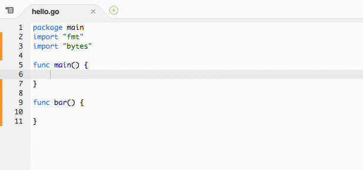

# c9.ide.language.go

Go code completion proof of concept the Cloud9 IDE

Please refer to the SDK documentation at
https://cloud9-sdk.readme.io/v0.1/docs/language-tooling and
https://cloud9-sdk.readme.io/v0.1/docs/existing-tools
for an overview of the APIs and techniques used in this plugin.

# Using This Plugin

This plugin is still marked "experimental". To use it in Cloud9,
please go to Cloud9 > Preferences > Experimental > Go Code Completion.

## License

MIT