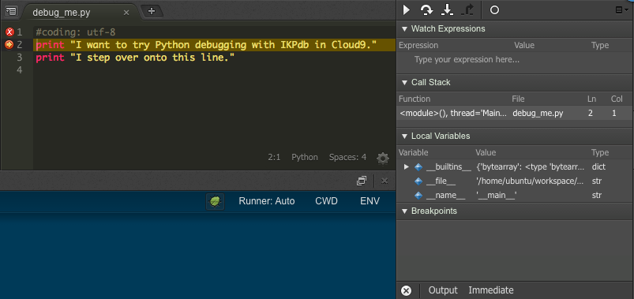

Cloud9 debugger client plugin for the IKPdb python debugger.
============================================================

Features
--------

* Debugging of multithreaded programs
* Conditional breakpoints
* Variables hot modifications
* "Turbo mode"
* easy integration in frameworks

Installation
------------

This plugin is installed by default in any new Cloud9's workspaces.

.. _getting-started:

Getting started
---------------

Go to `Cloud9 <https://c9.io/>`_, create an account there then:

1. Create a Workspace using the Python template
2. Create a new file with a few statements and save it as "debug_me.py".

You can copy / paste this snippet.

.. code-block:: python

   #coding: utf-8
   print "I want to try Python debugging with IKPdb in Cloud9."
   print "I step over onto this line."

3. Set a breakpoint on the first line by clicking in the left margin until a 
red circle appears.

**Ignore the red check button on line 1 ; as it is relevant only for Django development.**

.. image:: docs/index_pic1__py_snippet.png

4. Click on the Run button at the Top menu right-hand side.

The debugger is now open on the breakpoint you defined at step 3.

Now you can:

* Play with the debugger
* Read the `Cloud9 debugging documentation <https://docs.c9.io/docs/debugging-your-code>`_ to discover all Cloud9 features related to debugging.
* Read `IKPdb documentation <https://ikpdb.readthedocs.io/>`_ to get information about IKPdb and Python debugging.

Documentation
-------------

https://ikpdb.readthedocs.io/

Requirements
------------

CPython 2.7

License
-------

``Cloud9 IKPdb's debugger client`` is licensed under the MIT License.
See the LICENSE file at the root of this repository.

Source code
------------

Source code is available on github:

https://github.com/audaxis/c9.ide.run.debug.ikpdb.git

Issues
------

Issues are managed using Github's Issues Tracker.

