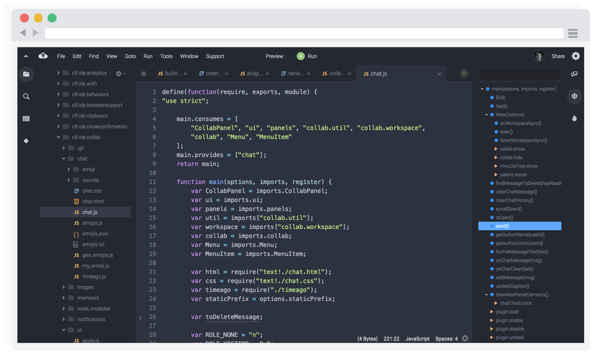

# Cloud9 Jett Theme
### A flat theme for C9 IDE

Give your Cloud9 instance a modern look!



## Features
- Animations!
- Retina ready!
- Modern fonts!
- Updated filetype icons!

## Compatibility

- Tested with C9 _v3.1.1022_
- Latest version of Chrome, Safari, Firefox


## Installation
1. Git clone or download this repo into `c9sdk/plugins/c9.ide.theme.jett`
2. Open `c9sdk/configs/client-default.js`. Before `return plugins;` add the following:

    ```js
    {
       packagePath: "plugins/c9.ide.theme.jett/plugin",
       staticPrefix: staticPrefix + "/plugins/c9.ide.theme.jett"
    }
    ```

    > **Note**: This plugin styles collaborative features and has a hard set dependancy on `--collab` being enabled.

3. Open `c9sdk/configs/standalone.js`. Add the following somewhere in the config:

    ```js
    {
       packagePath: "./c9.ide.theme.jett/build-theme",
       pathRoot: __dirname
    }
    ```

4. Run cloud9 in `--collab` mode.

    ```
    node server.js -p 8081 -a : --collab
    ```

5. Upon launching your Cloud9 instance you should have a new color option in _Preferences > Themes > Flat Theme_. This will allow you switch this theme on/off.

### Minification

If you want to run cloud9 with minification turned on ( `--packed` mode ), you'll need to rebuild assets.

  ```
  scripts/makestandalone.sh --compress
  ```

### Customize CSS

This is a little manual at the moment.

1. Delete the current compilation. (`rm build/compile_jett.css`)
2. Restart cloud9. The server-side plugin will detect the missing asset and rebuild it.

## License
- MIT

## Contributing

Please submit a pull request through github.

## Author
- GitHub: https://github.com/jumbojett/
